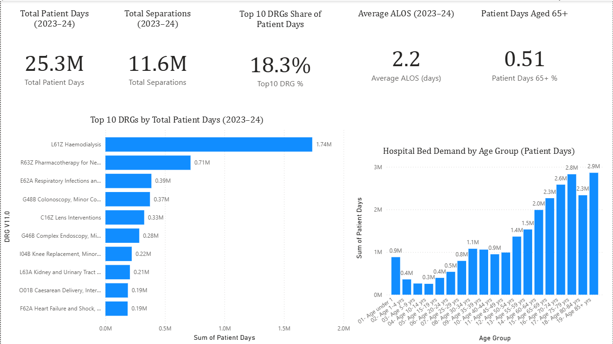
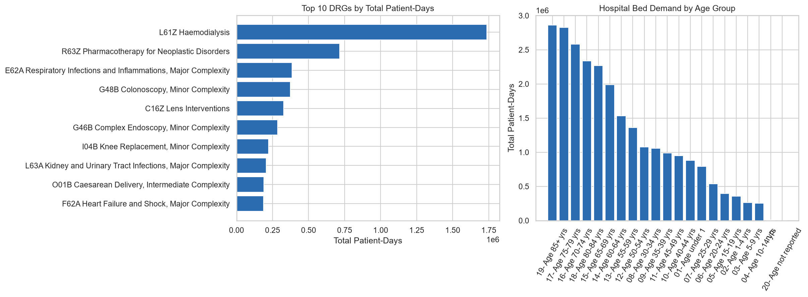

# Hospital Bed Capacity Analytics

**Which hospital conditions drive the most bed demand in Australia — and how much capacity could targeted improvements free up?**

A predictive analytics case study using national hospital activity data to help hospital operations teams move from reactive bed management to forecasting and targeted intervention.

---

## The Business Problem

Australian hospitals are under sustained capacity pressure. In 2023–24, public and private hospitals recorded **12.6 million hospitalisations** and delivered **33.9 million patient-days** of care across **672 public hospitals** (AIHW 2024). An ageing population is only increasing this pressure.

Hospital bed congestion — high demand combined with prolonged stays for certain conditions — reduces throughput, delays treatment, and drives up operating costs. Reported bed-day costs already run from ~$1,075 AUD/day (NSW average) to $2,370+ AUD/day (WA average) and up to $4,875 AUD/day for ICU-level care.

**The business question:** which patient conditions (AR-DRGs) contribute most to national bed demand, and how much capacity and cost could a hospital recover by targeting length-of-stay improvements at just the highest-burden conditions — instead of a costly system-wide initiative?

## My Approach

1. **Clean and aggregate** a year of national hospital activity data (AIHW AR-DRG Data Cube, 2023–24 — 44,513 records) to a planning-relevant level: condition × age group.
2. **Model Average Length of Stay (ALOS)** with a transparent regression model, so hospitals can forecast how long a patient in a given segment is likely to stay — before it happens.
3. **Run a targeted scenario**: what happens to bed demand if the 50 highest-burden segments improve their length of stay by 5–10%?
4. **Translate the result into business terms** — beds freed per day and dollars avoided — using cost-per-bed-day benchmarks published by NSW Health and the WA Audit Commission, rather than one invented number.

## Key Findings

| Metric | Result |
|---|---|
| Model accuracy (R²) | **0.855** — explains ~85% of the variation in length of stay |
| Model error (MAE) | **1.17 days**, vs. 4.58 days for a naive "always predict the average" baseline (**74% error reduction**) |
| Biggest bed-demand drivers | **Haemodialysis (L61Z)** and **pharmacotherapy for neoplastic disorders (R63Z)**, concentrated in patients aged 65+ |
| Bed-days freed (10% ALOS reduction, top 50 segments) | **~574,000 bed-days/year** (~1,571 beds/day on average) |
| Estimated cost avoided (10% scenario, @ $2,500/bed-day) | **~$1.4 billion AUD/year** |

> **On the $ figure:** cost-per-bed-day is a planning assumption, not audited hospital accounting data — published Australian benchmarks range from ~$1,075/day (NSW) to ~$4,875/day (ICU-level care). The **bed-days-saved** number is the more robust output of the model, since it doesn't depend on any cost assumption at all; the dollar figure should be read as an order-of-magnitude business case, not a forecast. Full sensitivity discussion in the [executive summary](executive_summary.md).

## Business Recommendations

1. **Target haemodialysis and neoplastic pharmacotherapy first** — a small number of conditions account for a disproportionate share of national bed-days, so a focused intervention outperforms a broad, system-wide program.
2. **Use predicted ALOS as an early-warning capacity signal** for bed management teams, so occupancy pressure for a segment can be forecast rather than discovered.
3. **Strengthen discharge planning and outpatient follow-up** specifically for the highest-burden segments identified by the model.
4. **Report financial impact as a range tied to cited benchmarks**, not a single number — this is a healthier way to bring a data-driven business case into a planning conversation.

## Limitations

- National-level data — doesn't capture hospital-specific factors like severity, facility type, or local bed availability.
- Linear regression was chosen for transparency over a small accuracy gain from a more complex model — appropriate for a first planning tool.
- Single year of data (2023–24); not yet validated as a trend across years.
- The scenario holds admission volumes constant and doesn't model beds being immediately backfilled by demand growth.

Full discussion of methodology, sourcing and limitations: **[executive_summary.md](executive_summary.md)**.

## Tools & Skills

`Python` (pandas, scikit-learn, matplotlib) · `Power BI` · predictive modelling & regression · scenario/sensitivity analysis · translating technical results into business recommendations for non-technical stakeholders.

## Repository Contents

| File | Description |
|---|---|
| [`hospital_capacity_analysis.ipynb`](hospital_capacity_analysis.ipynb) | Full analysis: data cleaning, modelling, scenario analysis, code and charts |
| [`executive_summary.md`](executive_summary.md) | Full write-up: industry context, methodology, findings, recommendations, references |
| [`hospital_capacity_dashboard.pbix`](hospital_capacity_dashboard.pbix) | Power BI dashboard (open in Power BI Desktop) |
| `hospital_capacity_dashboard_export.csv` | Aggregated model output feeding the dashboard |
| `ar-drg_2023-24_aihw.xlsx` | Source dataset — AIHW AR-DRG Data Cube 2023–24 (public data, [aihw.gov.au](https://www.aihw.gov.au/hospitals-data/ar-drg-data-cubes)) |

---

*Capstone project — Master of Business Analytics, Kaplan Business School. Data: Australian Institute of Health and Welfare (AIHW), AR-DRG Data Cube 2023–24 (public dataset).*
